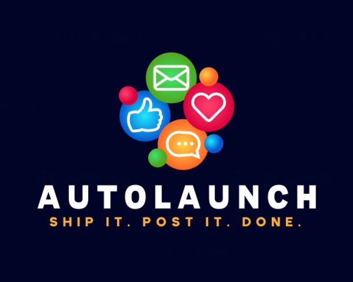

<div align="center">



<br/>

# ⚡ AutoLaunch

### AI-Powered Social Media Management Platform

<p>
  
  
  
  
  
  
</p>

<p>
  <a href="#-features">Features</a> •
  <a href="#-screenshots">Screenshots</a> •
  <a href="#-quick-start">Quick Start</a> •
  <a href="#-tech-stack">Tech Stack</a> •
  <a href="#-project-structure">Structure</a>
</p>

</div>

---

## ✨ What is AutoLaunch?

AutoLaunch is a **full-stack social media management platform** that lets you schedule posts, generate AI content, manage your media library, track analytics, and connect all your social accounts — all from one beautiful dashboard.

> Built for the **April Hackathon 2025** 🚀

---

## 🖼️ Screenshots

<div align="center">


</div>

---

## � Features

<table>
  <tr>
    <td>📅 <b>Post Scheduling</b></td>
    <td>Schedule posts across multiple platforms with calendar & list views</td>
  </tr>
  <tr>
    <td>🤖 <b>AI Agents</b></td>
    <td>Content Writer, Hashtag Optimizer, Trend Spotter & Nabr Visual Prompt Builder</td>
  </tr>
  <tr>
    <td>🎨 <b>Image Generation</b></td>
    <td>Generate images from captions via Nabr AI — directly from the schedule panel</td>
  </tr>
  <tr>
    <td>📊 <b>Analytics</b></td>
    <td>Track impressions, engagement, follower growth with per-platform breakdowns</td>
  </tr>
  <tr>
    <td>🖼️ <b>Media Library</b></td>
    <td>Upload, manage and preview images & videos with drag-and-drop support</td>
  </tr>
  <tr>
    <td>� <b>Integrations</b></td>
    <td>Connect Instagram, LinkedIn, Facebook, TikTok, YouTube, Pinterest & more</td>
  </tr>
  <tr>
    <td>🏷️ <b>Brand Hub</b></td>
    <td>Manage brand identity, voice, colors, logo, templates and exports</td>
  </tr>
  <tr>
    <td>🔌 <b>Plugins</b></td>
    <td>Extend functionality with toggleable plugins per workspace</td>
  </tr>
  <tr>
    <td>💳 <b>Billing</b></td>
    <td>Free, Pro and Business plans with upgrade flow</td>
  </tr>
  <tr>
    <td>⚙️ <b>Settings</b></td>
    <td>Profile, notifications, team members, API keys</td>
  </tr>
</table>

---

## ⚡ Quick Start

```bash
# 1. Clone the repo
git clone https://github.com/Bhavik04-coder/AutoLaunch.git
cd AutoLaunch

# 2. Install dependencies
npm install

# 3. Set up environment variables
cp .env.local.example .env.local
# Fill in your Supabase + NextAuth credentials

# 4. Run the dev server
npm run dev
```

Open [http://localhost:4200](http://localhost:4200) in your browser.

---

## 🔑 Auth

Use any email and password to log in — no setup required for demo mode.

```
Email:    test@example.com
Password: 123
```

---

## 🛠️ Tech Stack

| Layer | Technology |
|---|---|
| Framework | Next.js 16 (App Router) |
| Language | TypeScript 5 |
| UI | React 19 + SCSS Modules + Tailwind CSS 4 |
| Database | Supabase (PostgreSQL) |
| Auth | NextAuth v5 |
| AI | Pollinations.ai · Ollama (llama3.2 / llava) |
| 3D / Shaders | Three.js · @react-three/fiber · ShaderGradient |
| Deployment | Netlify |
| Monitoring | Sentry |

---

## 📁 Project Structure

```
AutoLaunch/
├── src/
│   ├── app/
│   │   ├── (app)/
│   │   │   ├── (site)/          # Main app pages
│   │   │   │   ├── launches/    # Post scheduling
│   │   │   │   ├── agents/      # AI agents
│   │   │   │   ├── analytics/   # Analytics dashboard
│   │   │   │   ├── media/       # Media library
│   │   │   │   ├── billing/     # Billing & plans
│   │   │   │   └── settings/    # User settings
│   │   │   └── auth/            # Login / Register
│   │   └── api/                 # API routes
│   ├── components/              # React components
│   ├── contexts/                # Global state (React Context)
│   └── lib/                     # DB helpers, auth, Supabase
├── supabase/
│   └── schema.sql               # Database schema
└── public/                      # Static assets
```

---

## 📝 Scripts

```bash
npm run dev      # Dev server on port 4200
npm run build    # Production build
npm start        # Production server
npm run lint     # ESLint
```

---

## 🗄️ Database Setup (Supabase)

1. Create a project at [supabase.com](https://supabase.com)
2. Run `supabase/schema.sql` in the SQL editor
3. Copy your project URL and anon key into `.env.local`

```env
NEXT_PUBLIC_SUPABASE_URL=your_supabase_url
NEXT_PUBLIC_SUPABASE_ANON_KEY=your_anon_key
NEXTAUTH_SECRET=your_secret
NEXTAUTH_URL=http://localhost:4200
```

---

## 🤝 Contributing

Pull requests are welcome. For major changes, open an issue first to discuss what you'd like to change.

---

<div align="center">

Made with ❤️ for the April 2025 Hackathon


</div>
